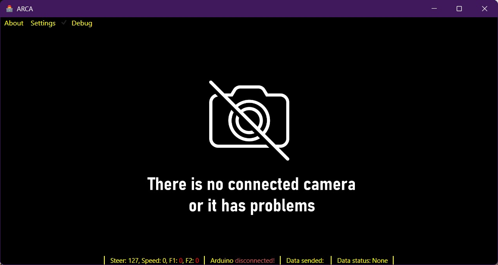
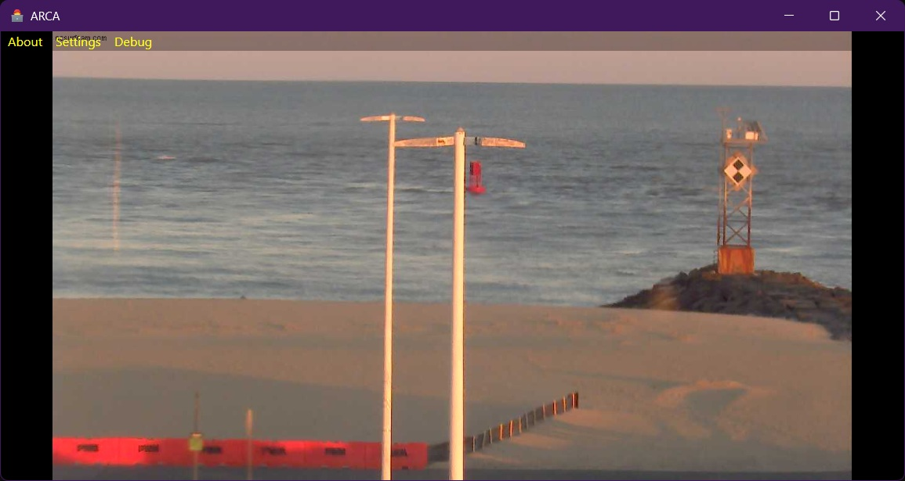

# 🏎️ ARCA (Arduino Radio Controlled App)
**Arduino-Based Remote Camera Access & Control**

[English](#english) | [Українська](#українська)

---

## 🇬🇧 English Version

**ARCA** is a software complex designed for remote control of a hovercraft drone equipped with FPV capabilities. This project is a key component of the complex diploma work: "Design and Manufacturing of a Hovercraft Drone Model."

### 🎯 Key Features
- **Multi-Input Support:** Seamlessly switch between Xbox/PS4 gamepads and keyboard controls.
- **Smart Device Discovery:** Optimized COM port scanning (fixed Bluetooth interference issues).
- **Low Latency Control:** High-frequency data polling for precise maneuvering.
- **Telemetry & Debug:** Real-time monitoring of `Steer`, `Speed`, and `F1/F2` states with connection status tracking.
- **FPV Integration:** Connection for Arduino-based remote devices with ESP32 or other IP cameras.

### 👨‍💻 Arduino Code
The repository includes code for the **Arduino sending device (Pro Micro)**, the **Arduino receiving device (Nano)**, and a **basic example for ESP32-CAM**.

### 👥 The Team
Developed by a team from Khmelnytskyi Polytechnic College:
* **M. Kulikov ([@BronievM](https://github.com/BronievM))** — System architecture, WPF development, Hardware/Software integration.
* **A. Gnatyuk** — Stabilization algorithms and software logic.
* **N. Demush ([@nazar350](https://github.com/nazar350))** — Hardware design and manufacturing of the drone.

---

## 🇺🇦 Українська версія

**ARCA** — це програмний комплекс для дистанційного керування дроном на повітряній подушці з підтримкою FPV. Проєкт є частиною комплексного дипломного проєкту: «Проєктування та виготовлення моделі дрона на повітряній подушці».

### 🎯 Ключові особливості
- **Підтримка декількох пристроїв:** Безшовне перемикання між геймпадами Xbox/PS4 та клавіатурою.
- **Розумний пошук пристроїв:** Оптимізоване сканування COM-портів (виправлено проблему зависання через Bluetooth).
- **Керування з низькою затримкою:** Високочастотне опитування даних для маневрування.
- **Телеметрія та дебаг:** Моніторинг станів `Steer`, `Speed`, `F1/F2` та статусу зв'язку в реальному часі.
- **FPV інтеграція:** Підключення до ESP32 або інших IP-камер.

### 👨‍💻 Код Arduino
Цей репозиторій містить код для **передавального пристрою Arduino (Pro Micro)**, **приймального пристрою на базі Arduino (Nano)** та **базовий приклад для ESP32-CAM**.

### 👥 Команда проєкту
Розроблено командою випускників Хмельницького політехнічного коледжу:
* **М. Куліков ([@BronievM](https://github.com/BronievM))** — Архітектура системи дистанційного керування, розробка WPF додатка, Hardware/Software інтеграція.
* **А. Гнатюк** — Алгоритми стабілізації та логіка ПЗ.
* **Н. Демуш ([@nazar350](https://github.com/nazar350))** — Проєктування та виготовлення апаратної частини дрона.

---

## 🖼 Screenshots / Скріншоти

  
*Main Interface with Controller Connected / Головний інтерфейс з підключеним контролером*

  
*FPV View from a Remote Camera / Вигляд FPV з віддаленої камери*

---

## 📹 IP Cameras for Testing / Камери для тестування
To test the video streaming functionality without a drone, you can use public streams:  
Для тестування стрімінгу відео без дрона можна використати публічні камери:  
🔗 [GitHub - Public IP Cameras](https://github.com/fury999io/public-ip-cams)

---

## 🛠 Tech Stack / Стек технологій
| Component | Technologies |
|:---|:---|
| **Languages** | C#, C++ (Arduino) |
| **Frameworks** | .NET WPF, SharpDX (DirectInput) |
| **Hardware** | Arduino Nano/Uno/Pro Micro, NRF24L01+ |

---

## 📝 Technical Notes / Технічні замітки
- **Bluetooth Handling (Fixed):** Previous versions experienced freezes during COM port discovery if Bluetooth was enabled. Starting from **v.1.2.0**, WMI queries are optimized to ignore virtual Bluetooth ports, ensuring stable performance.
- **Bluetooth (Виправлено):** Попередні версії зависали під час пошуку COM-портів, якщо Bluetooth був увімкнений. Починаючи з **v.1.2.0**, WMI-запити оптимізовано для ігнорування віртуальних портів Bluetooth.

---